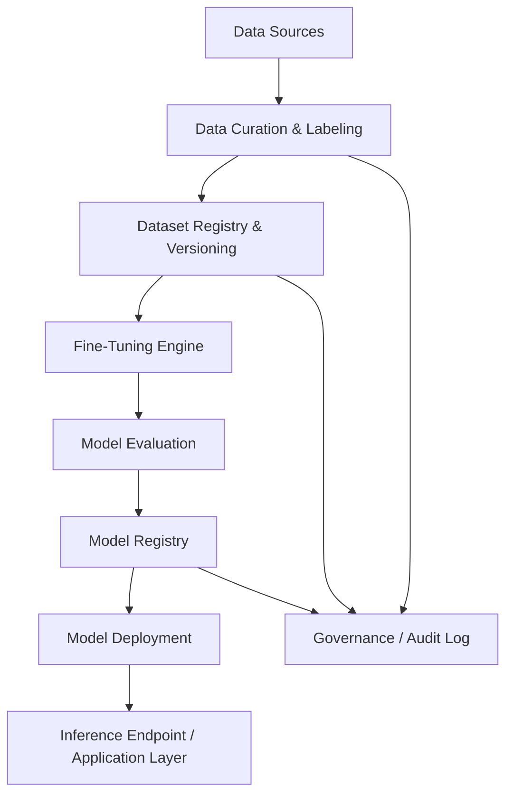
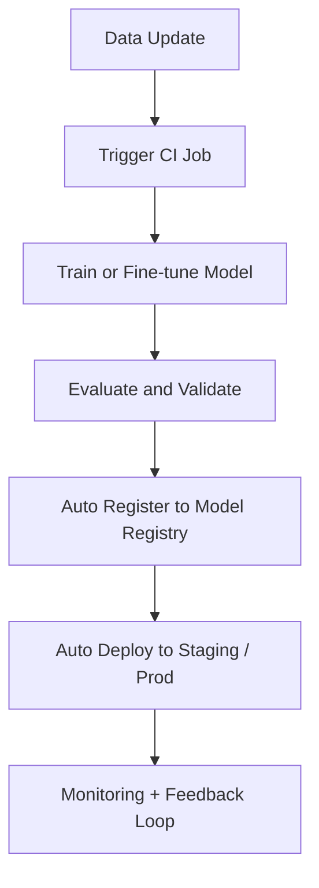

# Fine-Tuning Platform Design for Industry-Specific LLMs

## 1. Business Requirements

### Objective:

Build a governed, auditable, and scalable **LLM Fine-Tuning Platform** that supports:

- Industry-specific use cases (e.g., Manufacturing, Supply Chain, Inventory, Energy, Finance).
- Iterative fine-tuning workflows (e.g., LoRA, QLoRA, Full Fine-tuning, DPO, GPRO).
- Dataset creation, preprocessing, evaluation, and versioning.
- Multi-modal capabilities (text, images, sensor data, etc.).
- Use of both open-source (e.g., Hugging Face) and proprietary models (e.g., OpenAI, Anthropic, Cohere).
- Support for model version control, CI/CD pipelines, and MLOps best practices.

### Key Stakeholders:

- IT Admin (security, auditing, access control)
- MLOps Engineer (deployment, monitoring)
- Data Scientist (model development)
- Domain Expert (data labeling and review)
- Business Owner (KPI alignment)

## 2. High-Level Architecture



## 3. Dataset Creation

### General Steps:

1. Identify business use case and knowledge domain.
2. Collect raw data from structured and unstructured sources.
3. Annotate using labeling tools (Label Studio, Prodigy, Snorkel).
4. Preprocess:
   - Tokenization (e.g., tiktoken, transformers tokenizer)
   - Formatting (e.g., ChatML, Alpaca format)
5. Store in `datasets` versioned folder or registry (e.g., DVC, Hugging Face Hub).

### Example: Manufacturing - Equipment Maintenance Q&A

```python
import json
import random

examples = [
    {
        "instruction": "What causes frequent motor failure on the production line?",
        "input": "",
        "output": "Common causes include overload, misalignment, and inadequate lubrication."
    },
    {
        "instruction": "How do you reset a fault code on PLC?",
        "input": "Model: Siemens S7",
        "output": "Use TIA Portal to go online, then clear fault memory using the reset function."
    }
]

with open("maintenance_dataset.jsonl", "w") as f:
    for ex in examples:
        f.write(json.dumps(ex) + "\n")
```

## 4. Fine-Tuning Workflow

### Supported Techniques:

- **LoRA / QLoRA**: Efficient low-rank adaptation using PEFT and bitsandbytes.
- **Full Fine-Tuning**: Modify all model weights (for base model control).
- **GPRO / DPO / RLHF**: Reinforcement-style optimization for preference alignment.

### Python Example: QLoRA (Using PEFT + Hugging Face)

```python
from transformers import AutoTokenizer, AutoModelForCausalLM, TrainingArguments, Trainer
from peft import prepare_model_for_kbit_training, get_peft_model, LoraConfig
from datasets import load_dataset

model = AutoModelForCausalLM.from_pretrained("meta-llama/Llama-2-7b-hf", load_in_4bit=True)
tokenizer = AutoTokenizer.from_pretrained("meta-llama/Llama-2-7b-hf")

model = prepare_model_for_kbit_training(model)
config = LoraConfig(r=8, lora_alpha=16, target_modules=["q_proj", "v_proj"], lora_dropout=0.1)
model = get_peft_model(model, config)

dataset = load_dataset("json", data_files="maintenance_dataset.jsonl")

training_args = TrainingArguments(
    output_dir="./qlora-model",
    per_device_train_batch_size=4,
    num_train_epochs=3,
    logging_steps=10,
    save_strategy="epoch"
)

trainer = Trainer(
    model=model,
    args=training_args,
    train_dataset=dataset["train"]
)

trainer.train()
```

#### References and Resources:

- [LoRA with Transformers (GitHub)](https://github.com/huggingface/peft)
- [QLoRA Notebook by Tim Dettmers (Colab)](https://colab.research.google.com/drive/1BxQfEo4lRtMzjskG1AB9eHAmE9UbiNJ9?usp=sharing)
- [Full Fine-Tuning with Hugging Face Transformers (GitHub)](https://github.com/huggingface/transformers/blob/main/examples/pytorch/language-modeling/run_clm.py)
- [GPRO (GitHub)](https://github.com/OpenAccess-AI-Collective/GPRO)
- [Fine-tuning LLMs on Domain-Specific Data (Medium)](https://medium.com/@venelin.valkov/fine-tune-llm-on-domain-specific-data-1cb9045e5f2e)
- [Fine-tuning with RLHF (Medium)](https://medium.com/@sebastianruder/reinforcement-learning-for-fine-tuning-language-models-d5e8a7f8d7d1)
- [QLoRA Training Overview (Medium)](https://medium.com/@abhishekmishra_26677/qlora-parameter-efficient-fine-tuning-of-llms-82d695c4c3a0)

## 5. Evaluation Strategy

### Model Evaluation Metrics:

- **BLEU / ROUGE / METEOR** (text match quality)
- **Exact Match (EM) / F1** (QA tasks)
- **Custom Domain-Specific Tests**: accuracy on domain terms, logic chaining.
- **Human Review via Evaluation UI**

### Automated Evaluation:

```python
from evaluate import load

metric = load("rouge")
predictions = ["Common causes include overload..."]
references = ["Common causes include misalignment and overload..."]
print(metric.compute(predictions=predictions, references=references))
```

## 6. Governance & Auditing

- Store all fine-tune runs in MLflow or Weights & Biases
- Enable audit logs for data change, model deployment, access logs
- Secure model access with RBAC, SSO, and signed URLs
- Use tools like Azure Purview or AWS DataZone for lineage

## 7. Security and Well-Architected Practices

| Pillar                 | Practice                                            |
| ---------------------- | --------------------------------------------------- |
| Security               | RBAC, VPC, Endpoint Isolation, TLS, Secret Rotation |
| Reliability            | Retry logic, fault zones, replication               |
| Performance            | Quantization, vLLM, flash attention, batching       |
| Cost Optimization      | Use LoRA, Spot Instances, model offloading          |
| Operational Excellence | Monitoring, CI/CD, versioning                       |

## 8. Choosing the Right Model

### Text vs Multimodal:

- Use **text-only** for conversational AI, document understanding.
- Use **multi-modal** (e.g., Llava, Gemini) for vision + text (factory floor image + instruction).

### Reasoning Models:

- Use models like **Claude 3**, **GPT-4**, or **Command R+** for complex chain-of-thought or RAG pipelines.

## 9. CI/CD and Versioning



## 10. Future Enhancements

- Add **Auto Labeling** with GPT-powered labeling agents
- Integrate **RAG** pipelines using domain vector stores
- Support for **agentic workflows** and **multimodal fusion**
- Feature store integration for structured tabular + LLM fusion

Let me know if you'd like UI wireframes, Kubernetes deployment YAMLs, or governance SOP templates.

