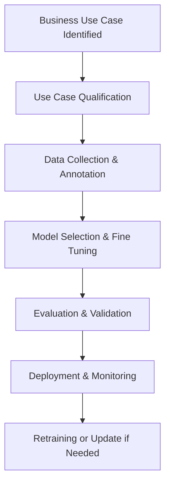
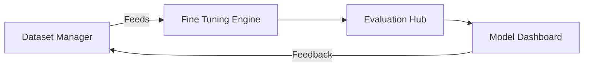

**Document Title: Architect's Guide to Validating and Planning Fine-Tuning Use Cases in Industry**

---

### 1. Objective

This document serves as a guide for architects and technical leaders to analyze, qualify, and plan fine-tuning projects for industry-specific use cases, ensuring strategic alignment, feasibility, and operational readiness.

---

### 2. Key Responsibilities of the Architect

- Evaluate and validate potential fine-tuning opportunities.
- Assess model suitability and fine-tuning feasibility.
- Coordinate with domain experts and business stakeholders.
- Define governance, compliance, and security requirements.
- Draft project scope, timeline, and resource planning.

---

### 3. Use Case Qualification Framework

#### 3.1 Use Case Identification

- Engage business units (e.g., Manufacturing, Supply Chain, Inventory) to capture pain points.
- Identify areas where generic models fall short.
- Document business goals, expected outcomes, and metrics.

#### 3.2 Assessment Checklist

| Criteria           | Details                                             |
| ------------------ | --------------------------------------------------- |
| Data Availability  | Sufficient historical data, domain-specific corpora |
| Data Sensitivity   | PII, regulatory, or proprietary data?               |
| Model Impact       | Revenue increase, efficiency gains, risk reduction  |
| Model Type         | Text, vision, multi-modal, tabular                  |
| Evaluation Metrics | Accuracy, BLEU, F1, latency, throughput             |

#### 3.3 Industry Examples

| Industry      | Example Use Case                                    |
| ------------- | --------------------------------------------------- |
| Manufacturing | Quality issue summarization from logs               |
| Supply Chain  | Predictive disruption alerts from unstructured data |
| Inventory     | Auto-replenishment recommendation tuning            |

---

### 4. Project Planning Workflow

#### 4.1 Stakeholder Inputs

- Business leaders: KPIs, ROI expectations
- Data owners: Access, quality, and annotation
- MLOps/IT: Governance, infrastructure, deployment models

#### 4.2 Dataset Planning

- Define data collection sources (logs, ERP exports, sensors, human reports)
- Annotate or synthesize instruction pairs
- Format datasets (JSONL, CSV, Parquet) for target model

#### 4.3 Tooling and Infrastructure

| Component             | Recommendation                                        |
| --------------------- | ----------------------------------------------------- |
| Dataset Labeling      | Label Studio, Prodigy                                 |
| Fine-Tuning Framework | PEFT + LoRA/QLoRA, Hugging Face Trainer, TRL, Axolotl |
| Experiment Tracking   | MLflow, Weights & Biases                              |
| Deployment            | vLLM, TGI, Ray Serve                                  |

#### 4.4 Security & Governance

- Model card for every tuned model
- Approval workflow for data usage
- Role-based access for pipelines
- Logging and monitoring model usage

---

### 5. Project Plan Template

| Phase           | Description                               | Owner                | Duration |
| --------------- | ----------------------------------------- | -------------------- | -------- |
| Discovery       | Identify business use case                | Architect + Business | 1 week   |
| Data Assessment | Check data quality and sufficiency        | Data Engineer        | 2 weeks  |
| Modeling        | Fine-tune and validate                    | ML Engineer          | 3 weeks  |
| Evaluation      | Compare with baseline, stakeholder review | Architect + SMEs     | 1 week   |
| Deployment      | Push to staging/production                | DevOps               | 1 week   |
| Monitoring      | Setup dashboards and alerts               | MLOps                | Ongoing  |

---

### 6. Success Metrics

- Model Accuracy or Task-specific Performance
- Business KPI uplift
- Time saved in task execution
- Model inference cost optimization

---

### 7. Supporting Templates & Tools (To Be Attached)

- Use Case Intake Form
- Data Inventory Template
- Model Evaluation Matrix
- Architecture Diagram (Mermaid)
- Budget Estimation Sheet
- **Use Case Template Example**:

```json
{
  "title": "Predictive Maintenance Alerts",
  "industry": "Manufacturing",
  "problem_statement": "Unexpected machinery downtime leads to productivity loss.",
  "data_sources": ["sensor logs", "maintenance reports"],
  "model": "LLaMA2-7B",
  "fine_tuning_type": "QLoRA",
  "evaluation_metrics": ["F1 Score", "Precision"],
  "expected_outcomes": "Reduce downtime by 25%"
}
```

---

### 8. UI Mockup Descriptions

- **Dashboard**: Displays all active fine-tuning projects, model versions, and performance comparisons.
- **Project Intake Wizard**: Step-by-step form to enter use case details, data sources, and desired outcomes.
- **Dataset Manager**: Upload/annotate datasets, assign to projects.
- **Evaluation Hub**: Compare baseline vs fine-tuned model using defined metrics.

---

### 9. SOPs (Standard Operating Procedures)

#### 9.1 Fine-Tuning SOP

1. Intake form submitted.
2. Dataset validated and preprocessed.
3. Initial training using selected framework.
4. Validation on domain test set.
5. Evaluation review with business SME.
6. Deployment to sandbox/staging.
7. Continuous monitoring.

#### 9.2 Data Creation SOP

1. Identify scenario and goal.
2. Generate samples using SME input or synthetic data generation.
3. Annotate with instructions and expected outputs.
4. Review and store in versioned dataset repo.

---

### 10. Mermaid Diagrams





---

### 11. Model Selection Guidance

| Model Provider | When to Use                                  |
| -------------- | -------------------------------------------- |
| Hugging Face   | Open-source, customizable, industry variants |
| OpenAI         | Strong reasoning, language understanding     |
| Cohere         | Enterprise use, RAG and embeddings           |
| Anthropic      | Safe outputs, dialogue optimization          |
| Gemini         | Multi-modal focus, real-time UI integration  |

---

### 12. Hardware, Resources & Cost Estimation

#### 12.1 Resource Planning

| Role          | Responsibility                        | Recommended Count |
| ------------- | ------------------------------------- | ----------------- |
| Architect     | Use case qualification, solutioning   | 1                 |
| Data Engineer | Data preprocessing and formatting     | 1–2               |
| ML Engineer   | Fine-tuning, training, evaluation     | 1–2               |
| DevOps/MLOps  | Deployment, monitoring, pipelines     | 1                 |
| SME (Domain)  | Use case validation, annotation input | 1–2               |

#### 12.2 Time Estimation

- Simple fine-tuning: 3–4 weeks (QLoRA, 7B model)
- Full fine-tuning: 5–8 weeks (more data, larger models)
- RAG + tuning hybrid: 4–6 weeks

#### 12.3 Hardware Needs

| Model Size  | GPU Requirements                | Notes                       |
| ----------- | ------------------------------- | --------------------------- |
| 7B (QLoRA)  | 1x A100 40GB or 2x L40s         | Budget-efficient, fast dev  |
| 13B–34B     | 2–4x A100 or H100 GPUs          | Multi-node support required |
| Full Tuning | High storage & memory (1TB SSD) | Slower, costlier            |

#### 12.4 Cost Estimation Factors

- GPU compute hours
- Storage & bandwidth
- Human resources (data prep, tuning, validation)
- Model hosting and monitoring

Use cloud calculators (AWS/GCP/Azure) or on-prem GPU server costs to calculate TCO.

---

### 13. Next Steps

- Conduct internal workshop with business & data teams
- Review candidate use cases using this framework
- Prioritize based on ROI, effort, and risk
- Initiate pilot project using above plan

